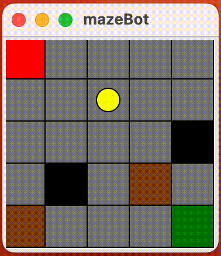

# mazebot
This is a demo I created when I was learning the basics of reinforcement learning. It uses the Q-learning algorithm to train a bot to navigate a maze automatically.

[](https://github.com/MGMCN/mazebot/blob/main/LICENSE)

## Usage
> version: Python 3.11

For macOS users, if you encounter ```ModuleNotFoundError: No module named 'tkinter'``` when running the code, you need to execute the corresponding commands for your version.
```bash
$ brew install python-tk@3.11
```
Install dependencies.
```bash
$ pip3 install -r requirements.txt
```
Run main.py
```bash
$ python3 main.py
```
Black represents traps, brown represents walls, green represents the destination, red represents the starting point, and gray represents the accessible path.👇🏻 (ps: If the bot falls into a trap, it will be returned to the starting point.)
<div align="center">  </div>
<div align="center">The bot will become smarter as it tries different moves.</div>

## Contributing
Contributions must be available on a separately named branch based on the latest version of the main branch.
